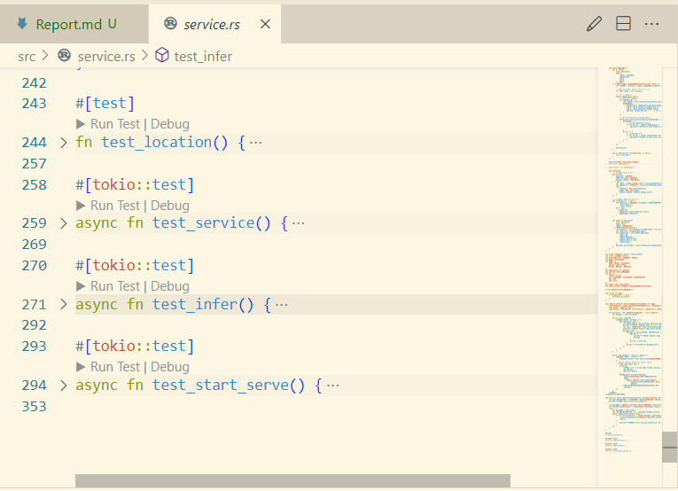

# InfiniTensor：人工智能编译器与大模型系统训练营（2024 夏季） - 汇报

@Author: 王翊嘉 / abcd1234  
@Email: abcd1234dbren@yeah.net

注：我提供了一个小的录屏，可以直观看到怎么使用。

## 目录

- [InfiniTensor：人工智能编译器与大模型系统训练营（2024 夏季） - 汇报](#infinitensor人工智能编译器与大模型系统训练营2024-夏季---汇报)
  - [目录](#目录)
  - [工作内容简介](#工作内容简介)
  - [工作内容详解](#工作内容详解)
    - [模型生成服务](#模型生成服务)
    - [模型 web-api](#模型-web-api)
    - [前端适配](#前端适配)
  - [遇到的重大问题](#遇到的重大问题)
    - [mlp 测例](#mlp-测例)
    - [知识方面的欠缺与困惑](#知识方面的欠缺与困惑)
    - [后端代码死锁](#后端代码死锁)
  - [评价](#评价)
  - [总结](#总结)

## 工作内容简介

在项目阶段，我完成的内容主要包括：

- 模型生成服务
- 模型 web-api
- 前端适配

## 工作内容详解

### 模型生成服务

模型生成服务主要是接收用户输入的代码，并调用大语言模型进行生成（续写）。支持单次调用时的 kvcache。如下图所示：

### 模型 web-api

模型 web-api 主要负责接收用户请求，并调用模型生成服务进行生成。同时，支持多用户并发请求。如下图所示：

### 前端适配

前端适配主要是将用户输入的内容转发至后端，并将后端内容返回。如下图所示：

## 遇到的重大问题

1. mlp 测例
2. 知识方面的欠缺与困惑
3. 后端代码的死锁

### mlp 测例

我发现老师提供的 mlp 测例存在问题，其不能很好的测试代码，具体情况已经提交 pr：[https://github.com/LearningInfiniTensor/learning-lm-rs/issues/5](https://github.com/LearningInfiniTensor/learning-lm-rs/issues/5)

这对我当时的工作产生了很大的困扰，我花费了较大量时间来定位错误位置，并尝试修复。最终，我通过重新读题，从而改好了我的 mlp 的代码，最终重新通过了测例。

### 知识方面的欠缺与困惑

我之前没有系统接触过大模型等机器学习内容，这使得我在项目阶段初期，一直不清楚我们在做什么。我在学习到一定的知识后，才逐渐明白，我们是在做 python 的机器学习的 transformer 库，之前老师确实也点出过，但当时没听明白:(

后续，我在实现模型生成服务时，也遇到了一些困惑，比如大量相关的术语：“堆叠”、“拼接”等，我都需要现去查询并学习，这带来了大量的负面体验。。。

不过好在，我们有交流群，还有老师答疑，这使得我起码能够有能询问的地方，如下图：

同时，再次感谢侯磊同学给出的资料，我照着它，推了大约足足 5 遍，感觉差不多是完全理解了（推完 2 遍后，我其实已经写完了代码，但我只是根据公式编程，没有自己的理解）

### 后端代码死锁

在 9.20 日，我开始尝试实现 web-api。最开始，我并不知道该怎么实现，但是我在《Rust 语言圣经》里，看到了“tokio”这个异步编程框架。后续，我还想到，之前的 InfiniTensor 项目，也是基于这个框架做的，那我应该也可以用这个框架。于是，我就开始尝试用这个框架来实现 web-api。

由于对知识的欠缺，我没法直接把启元的项目拿过来用（可能是因为底层对模型的特征包裹上不同，导致我没有选择将我做的模型进行包裹）。于是，我参照启元的项目，采用“面向测试开发”的思路，进行开发。这使得我的项目里，存在一系列的测试代码：

通过这些测试，我在 9.24 时，完成了基础的代码，解决了一堆爆红的编译器。但是，始终无法通过最后两个测试用例。

后续，我通过分析，发现是由于死锁问题导致的。解决了它之后，我的代码就能跑了。

## 评价

我的代码质量只能说堪堪入目，照比启元的项目来讲远远不如。

在底层上，我的模型只能跑在 CPU 上，启元的项目则可以跑在 GPU 上。我的模型只能支持 f32，并且单次调用；但启元的项目则可以支持大量的数据格式，并且支持多次调用等。

对于后端，我的模块化做的也是依托，代码也写的很乱。启元的项目则做的很好，模块化做的很好，代码也很整洁。我还是需要学习很多的。

对于服务端，我的代码写的也很不好。为了尽可能简化，我的 inputs 传参都是用的 String，而启元的项目支持的是 Vec<String>，这也使得我的代码在处理 inputs 时，没有考虑到内存上限的问题。同时，启元的代码又能支持“Session”相关的操作，但我也没有实现。

对于前端，我也是用别人的开源代码，顶多来说算是我稍微做了些适配，但适配也是以“裁剪”为主。

## 总结

通过此训练营的学习，我对大模型有了一定的认识，这期间学习到的知识，真的是让我受益匪浅。我觉得收获最大的是，我学习了怎么实现算子，我还学习了怎么使用 tokio 这个框架。以及相关的测试手段等。

同时，我再次对我的个人水平表达不满，训练营的时间限制中，对于我来说，可能是太短了。我还有很多想做的东西（比如老师提供的对话模型的适配），更好的前端接口等。但受限于我的能力，这些难以在规定时间内实现。
